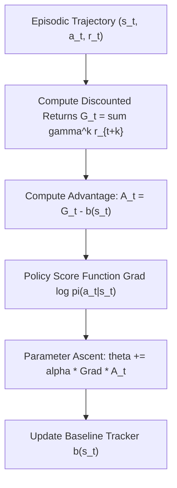

# genpark-reinforce-policy-gradient-baseline-skill

Agent Skill implementing the **REINFORCE Policy Gradient Algorithm** with state-value baseline subtraction for variance reduction in episodic reinforcement learning.

## Architectural Overview

